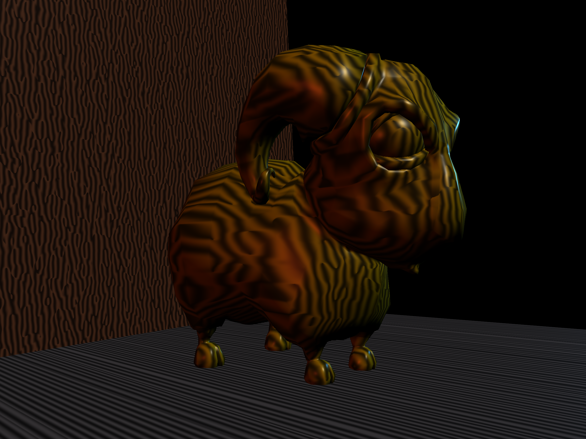
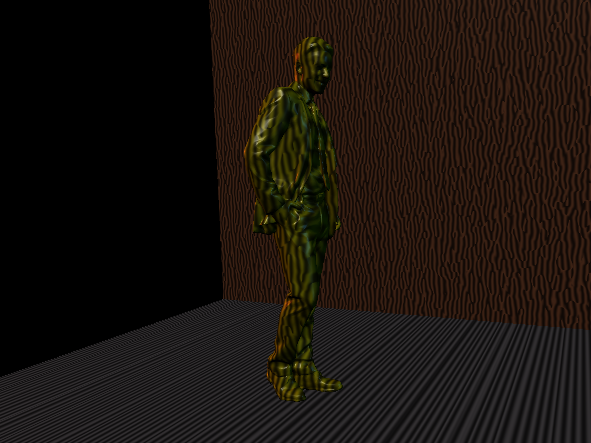
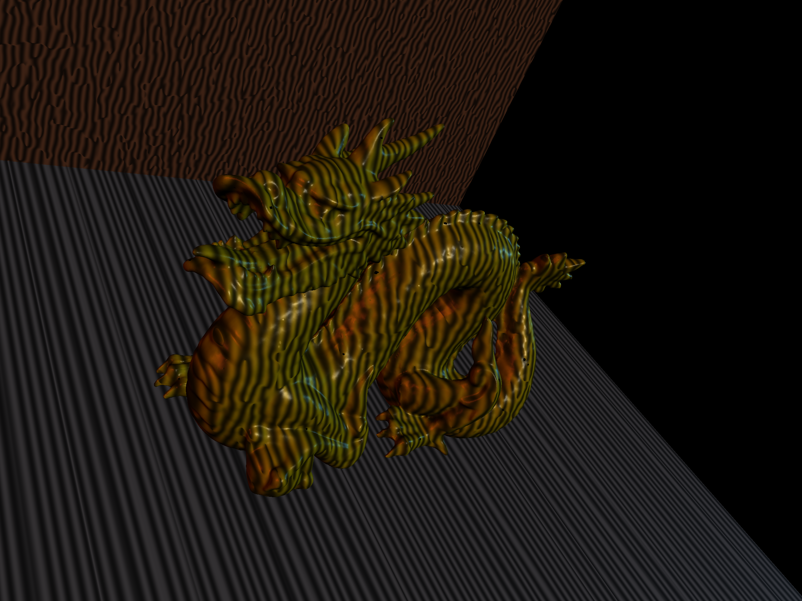

# Procedural Phasor Noise Implementation

Implementation of the paper ["Procedural Phasor Noise"](https://hal.science/hal-02118508/file/ProceduralPhasorNoise.pdf) (by Thibault Tricard, Semyon Efremov, Cédric Zanni, Fabrice Neyret, Jonàs Martínez, Sylvain Lefebvre) for the INF584 - Image Synthesis course project. 

## Dependencies
Have these dependencies in a directory called 'External':
- glfw
- glm
- stb_image
- glad

## Building
This is a standard CMake project. Do this to build it:

```
cd <path-to-project-directory>
cmake -B build
cmake --build build --config Release
```

## Running

To run the program:

```
cd <path-to-project-directory>
./Procedural_Phasor_Noise
```

Note that a collection of example meshes are provided in the Resources/Models directory. To run the code with a specific model (let's say with the file denis.off), do this:

```
cd <path-to-project-directory>
./Procedural_Phasor_Noise ./Resources/Models/denis.off
```

## Resulting Images





